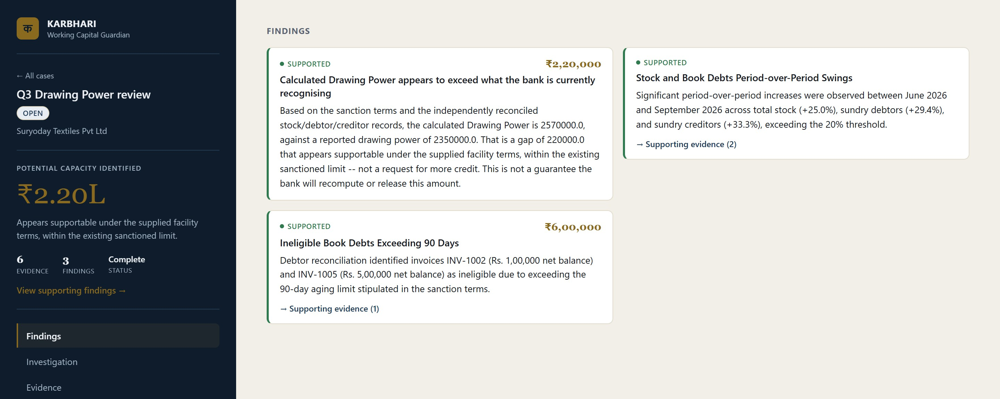
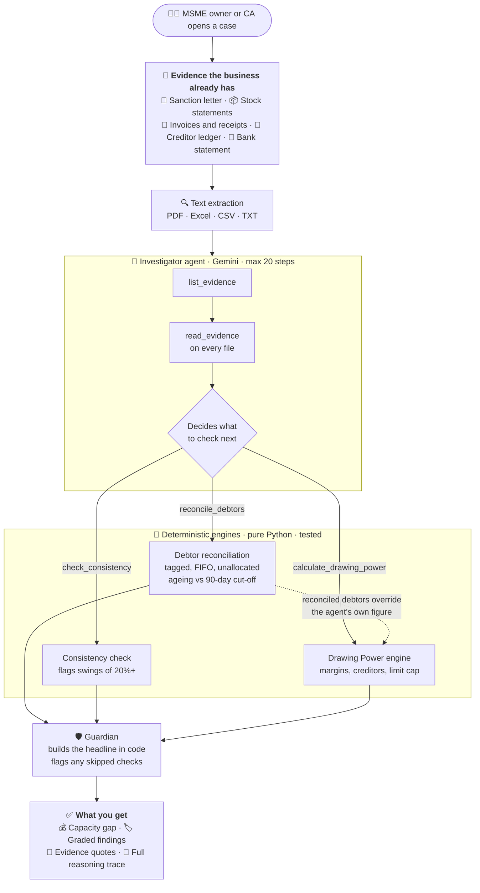
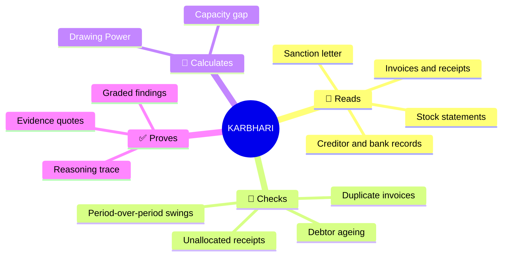
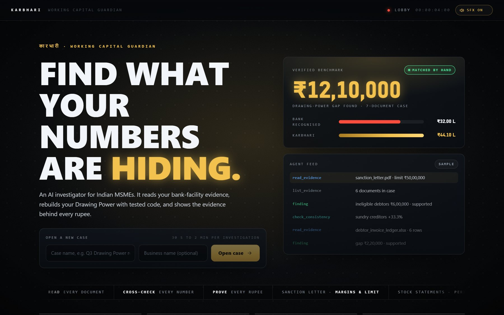
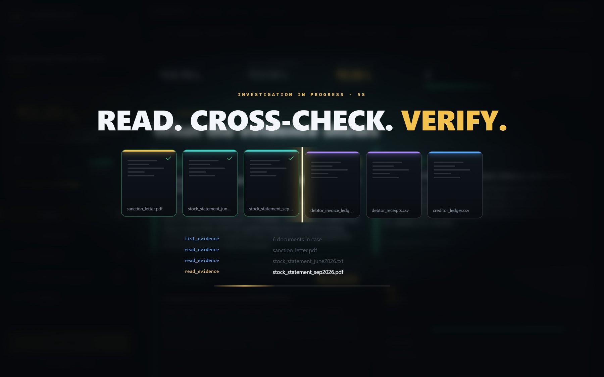
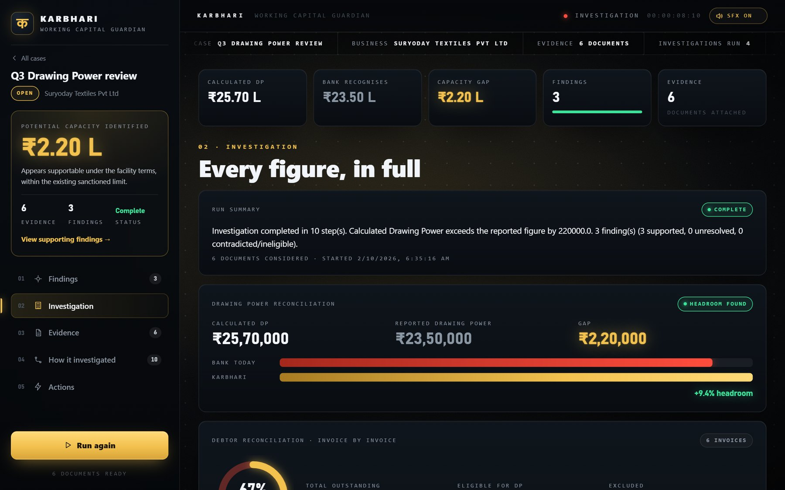

<p align="center"></p>

<h1 align="center">KARBHARI · कारभारी</h1>
<h3 align="center">Working Capital Guardian for Indian MSMEs</h3>

<p align="center"><b>Find what your numbers are hiding.</b> 🔍</p>

<p align="center">
  <a href="https://hub.docker.com/r/yieldnever/karbhari"></a>
  
  
  
  
  <a href="LICENSE"></a>
</p>

<p align="center">
  🎬 <a href="Karbhari%20Explainer%20Video.mp4">Explainer film</a> &nbsp;·&nbsp;
  📘 <a href="Karbhari-Product-Document.pdf">Product document</a> &nbsp;·&nbsp;
  🧭 <a href="Karbhari-Project-Guide.pdf">Project guide</a> &nbsp;·&nbsp;
  🧪 <a href="ASSETS%20FOR%20TESTING">Test files</a>
</p>

---

## 💡 What is KARBHARI?

Every MSME on a bank cash-credit line can only draw what its **Drawing Power** allows. The bank recalculates it every month from stock, debtors and creditors. When those numbers are stale, mis-aged or duplicated, the business quietly loses capital it is entitled to.

**KARBHARI investigates it for you.** Upload the documents you already have. An AI agent reads them, cross-checks them and rebuilds your Drawing Power from first principles. You get the gap, the reasons, and the evidence behind every rupee.

<p align="center"></p>
<p align="center"><sub>A live run on our test files: ₹2,20,000 of Drawing Power the facility supports but the bank isn't recognising.</sub></p>

## 🎯 Why it matters

- 🏦 **Capital gets stuck.** Small errors in stock statements or debtor ageing shrink the limit an MSME can actually use.
- 🧑‍💼 **Nobody has time to check.** Big companies have treasury teams. A small business has the owner.
- 🤖 **Chatbots don't solve it.** They give advice, do maths in prose and can't show their working.

KARBHARI gives a **defensible answer in minutes, not days**, honest enough to take to your banker or CA.

## 🗺️ How it works



**The model reasons. Python calculates.** The agent chooses what to read and which checks to run. Every number comes from deterministic, tested code that can't hallucinate.



## 📸 A look inside

A console built like a financial-investigation film: precise numerals, a quiet dot grid, colour that always means something (gold for capacity, red for problems, green for verified), smooth transitions and subtle interface sound effects you can mute.

<table>
  <tr>
    <td width="50%"><br><sub><b>Lobby.</b> Open a case, see the verified benchmark.</sub></td>
    <td width="50%"><br><sub><b>Investigating.</b> The agent reads, cross-checks and verifies each document.</sub></td>
  </tr>
  <tr>
    <td width="50%"><br><sub><b>Every figure.</b> Drawing Power, capacity bars and the debtor book.</sub></td>
    <td width="50%"><br><sub><b>Findings.</b> Graded, cited and always backed by tested code.</sub></td>
  </tr>
</table>

## 🇮🇳 Why it works in India

- **Works with what MSMEs already have.** Bank PDFs, Tally and Excel exports, CSVs. No new data entry, no bank integration.
- **Cheap to run.** One container, 1 CPU and 1 GB RAM, Gemini Flash-Lite free tier. Typically 30 seconds to 2 minutes per case.
- **Trusted by the people who matter.** Banks and CAs can audit every figure, because the arithmetic lives in code and every finding cites its source.
- **Honest by design.** It reports what weakens the owner's case as readily as what helps it, so it holds up in front of a credit officer.
- **Big addressable need.** India has over 6 crore MSMEs (Ministry of MSME), and working capital is the most common pain point for the ones with bank credit.

## ⚙️ Project specifications

| | |
|---|---|
| **Agent** | Bounded ReAct loop on Google Gemini, up to 20 tool calls, full trace saved |
| **Tools** | `list_evidence` · `read_evidence` · `reconcile_debtors` · `check_consistency` · `calculate_drawing_power` |
| **Engines** | Pure Python: per-debtor FIFO reconciliation, ageing, duplicates, ±20% variance flags, Drawing Power with sanctioned margins and limit cap |
| **Inputs** | Sanction letter, stock statements, debtor invoices and receipts, creditor ledger, bank statement (PDF, XLSX, CSV, TXT) |
| **Outputs** | Capacity gap, graded findings with evidence quotes, invoice-level reconciliation, step-by-step trace |
| **Console** | Film-style UI: count-up figures, transitions, live investigation overlay, synthesized sound effects (mutable) |
| **Stack** | FastAPI · SQLModel/SQLite · React 19 + TypeScript + Vite · Docker |
| **Quality** | 52 automated tests, including a live end-to-end run against Gemini |
| **Docker** | Public image `docker.io/yieldnever/karbhari:0.7.0` |

## 🚀 How to run

**1. Add your API key.** Copy `backend/.env.example` to `backend/.env` and paste a free key from [Google AI Studio](https://aistudio.google.com/apikey).

**2. Start it with Docker** (recommended):

```bash
docker build -t karbhari:0.7.0 .
run.bat        # or: docker run -p 8000:8000 --env-file backend/.env karbhari:0.7.0
```

Open **http://127.0.0.1:8000** 🎉

<details>
<summary><b>Or run backend and frontend separately (development)</b></summary>

```bash
# backend (Python 3.12+)
cd backend
python -m venv .venv
.venv\Scripts\activate          # macOS/Linux: source .venv/bin/activate
pip install -r requirements.txt
uvicorn app.main:app --port 8000

# frontend (Node 20+), in a second terminal
cd frontend
npm install
npm run dev                     # open http://127.0.0.1:5173
```

Run the tests with `cd backend && python -m pytest -q`.
</details>

## 🧪 What to test it on

Everything you need is in [`ASSETS FOR TESTING/`](ASSETS%20FOR%20TESTING).

1. Create a case and attach the six files, picking a category for each.
2. Click **Run investigation**.
3. You should see:

| Check | Expected result |
|---|---|
| Calculated Drawing Power | **₹25,70,000** vs ₹23,50,000 recognised by the bank |
| Capacity gap | **₹2,20,000** |
| Ineligible debtors | INV-1002 and INV-1005, past 90 days, **₹6,00,000** excluded |
| Period swings | Stock +25%, debtors +29.4%, creditors +33.3% |

## ✅ Verified, not just demoed

We built a tricky 7-document case and worked out the right answer **by hand first**. The live agent then matched it to the rupee: **₹12,10,000** gap, ₹44,10,000 calculated Drawing Power. Along the way it caught a duplicate ₹3,50,000 invoice, a ₹70,000 unallocated receipt, a 105-day-old invoice and a 38% stock swing.

## 🧭 Honest limits and what's next

- The agent can still skip the consistency check. KARBHARI flags the gap in its findings; if it tries to finish before calculating Drawing Power, it is sent back once to do so.
- No OCR yet, so scanned PDFs need a text layer.
- The Actions tab is coming next: an evidence-backed note to your bank.
- Creditors are reconciled as a total, not invoice by invoice.

## 📄 License

[Apache 2.0](LICENSE) · Built for Indian MSMEs
